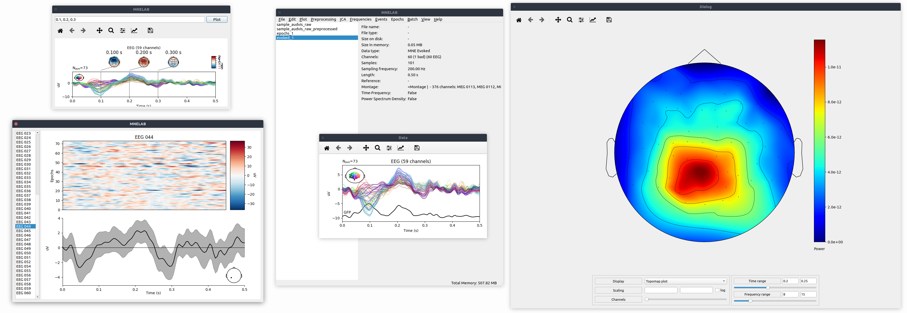

MNELAB
======

Graphical user interface (GUI) for [MNE](https://github.com/mne-tools/mne-python), a Python-based toolbox for EEG/MEG analysis.

### Screenshots

### Dependencies
MNELAB requires Python >= 3.6. In addition, the following Python packages are required:
- [PyQt5](https://www.riverbankcomputing.com/software/pyqt/download5) >= 5.6.0
- [numpy](http://www.numpy.org/) >= 1.8.1
- [scipy](https://www.scipy.org/scipylib/index.html) >= 0.17.1
- [matplotlib](https://matplotlib.org/) >= 2.0.0
- [mne](https://github.com/mne-tools/mne-python) >= 0.17

Optional dependencies provide additional features if installed:
- [scikit-learn]() (ICA computation via FastICA)
- [python-picard](https://pierreablin.github.io/picard/) (ICA computation via PICARD)
- [pyEDFlib](https://github.com/holgern/pyedflib) (export raw to EDF/BDF)
- [philistine](https://pypi.org/project/philistine/#description) (export raw to VHDR)

In general, it is recommended to always use the latest package versions.

### Features 
- Basic preprocessing (Filters, resampling, annotations of bads channels, importing of events and annotations, ICA processing, interpolation of bad channels, referencing...)
- Epoching of raw data with markers or events, Evoking of epoched data. 
- Visualization tools (Raw data, Interactive epoch image plots, Interactive power spectrum density and Interactive Time-Frequency dialog)
- Batch processing: Does the same process on a batch of files, like filtering, resampling or computing time-frequency or power spectrum density of each file.

### Additional features
MNELAB comes with the following features that are not available in MNE:
- Export raw to EDF/BDF (requires [pyEDFlib](https://github.com/holgern/pyedflib))
- Export raw to EEGLAB SET
- Import Cartool format (.sef )
- Import/Export to brainvision format (.vhdr)

### Installation
A package on [PyPI](https://pypi.python.org/pypi) will be available soon. Meanwhile, to use MNELAB first install all dependencies (e.g. via `pip` or `conda`) and then [download the source code](https://github.com/cbrnr/mnelab/archive/master.zip). Unpack it into a folder of your choice and run `python3 mnelab.py` in this folder (if this does not work try `python mnelab.py`, just make sure to use Python 3).

### License
MNELAB is under the BSD 3-clause license (Copyright (c) 2017, Clemens Brunner)
Philistine subfolder is under the BSD 3-clause license (Copyright (c) 2017--2018, Phillip Alday)
Modifications of original works are under the BSD 3-clause license (Copyright (c) 2019, Victor Férat, Tanguy Vivier)

